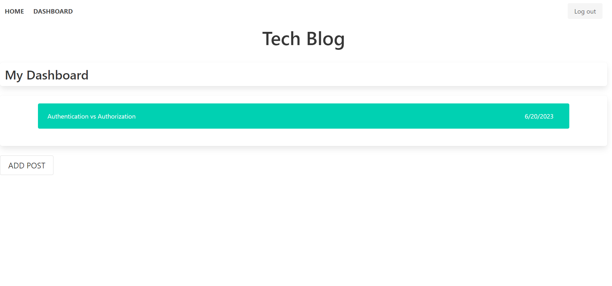

# Blog-site

[](https://opensource.org/license/mit/)

## Description

CMS style Blog site.
This Blog site, lets the person view all the posts with the posted date, and the user that posted it. Once a person creates an account, they can add comments to the existing posts, and can create , edit or delete their own post.


---

## Table Of Contents
                             
- [Description](#description)
- [Installation](#installation)
- [Usage](#usage)
- [License](#license)
- [Credits](#credits)

---

## Installation

To install the required dependencies, just run this code: 

```
npm i
```

---

## Usage
 Preview of the Blog-site:



[link](https://infinite-temple-42269-d5a50674bc55.herokuapp.com/)


## License

This Project is licenced under MIT license.

---


## Credits

You can find more about my work at my Github [oliver23n](https://github.com/oliver23n).


